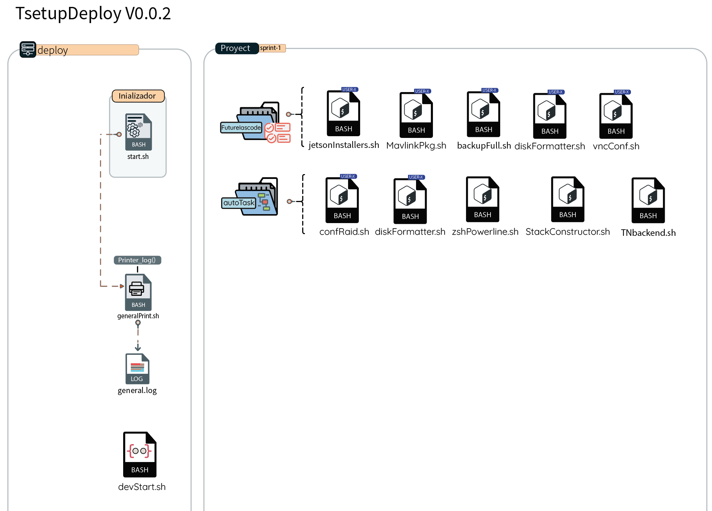

# Inicializacion 


Un instalador general para configuración de entornos, configuración de servidores o ejecución
de scripts para la automatización de ciertas tareas.

enviar el contenido a la Cloud Vm via Github

- Clonar el proyecto a /opt/tp/scripts/
```sh 
cd /opt
sudo mkdir -p tp/scripts
cd tp/
sudo git clone https://github.com/alphanetEX/TsetupDeploy.git scripts/
cd scripts/
sudo chmod 750 *.sh
sudo chmod 733 generalPrint.sh #backupFull.sh 
sudo bash start.sh
```


- Conecxion con maquinas con acceso a root AWS, EC2 via rsync
```sh 
rsync -rzt --progress --exclude={'examples/*',.git/*} -r $(pwd)/ root@ip-addr:/opt/tp/scripts
```
- Conecxion con maquinas con usuario de tipo SUDO

> :warning: **Recuerde agregar una una regla de acceso a /etc/sudoers**: dentro del servidor de la nube antes del uso de rsync: 

```sh
$ sudo echo "${USER} ALL= NOPASSWD:/usr/bin/rsync" >> /etc/sudoers 
```

- ejecutar en su maquina de tipo (OSX/LINUX)
```sh 
rsync -rzt --progress --exclude={.git/*} --rsync-path="sudo rsync" -r $(pwd)/ user@ip-addr:/opt/tp/scripts/
```

- nevegar a /opt y crear los folderes /tp/scripts/

> :warning: **Actualice manualmente el servidor e installe rsync si en caso no esta el paquete**: dado a que pueden aparecer pantallas de cambios de parte del coud provider,,!

## dentro de ese directorio ejecute
```sh 
$ sudo bash start.sh
```
- Diagram Implementation


###### si en caso hay problemas de ejecucion ejecute permisos 750 a cada unos de los archivos del directorio

###### las cosas no se dicen, se hacen, porque al hacerlas se dicen solas ~Woody Allen
